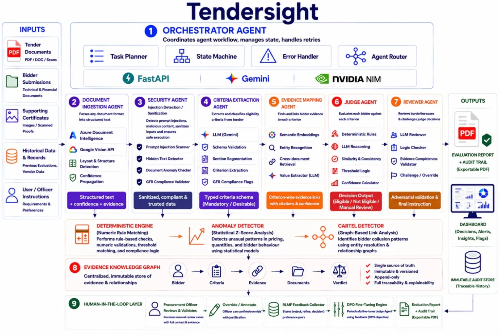

# TenderSight 🔍
### AI-Powered Intelligent Audit for Government Procurement

> **Intelligent Audit. Zero Bias. Full Transparency.**

[](https://tendersight-frontend.onrender.com/)


TenderSight replaces manual government tender evaluation with a 9-agent AI pipeline — reading documents, evaluating bidders, detecting fraud, and producing a legally defensible audit report in **under 10 minutes** (vs. 3-7 days manually).

---

## ⚙️ System Architecture

The platform is built around 9 specialized agents coordinated by an Orchestrator:



## ✨ Key Features

**🧠 Multi-Agent AI Evaluation**
Seven specialized agents handle ingestion, security scanning, criteria extraction, evidence mapping, judging, and adversarial review. Default verdict is `NOT ELIGIBLE` unless undeniable proof is extracted.

**🔗 Source-Level Audit Trail**
Every verdict links back to the exact paragraph in the original document. The Evidence Knowledge Graph is immutable, versioned, and append-only — fully traceable and explainable.

**🕵️ Dual Fraud Detection**
- *Financial Anomaly Engine* — Z-score analysis flags bids beyond ±1.1 standard deviations from the pool average
- *Cartel Detection Engine* — FalkorDB graph traversals detect shared directors, addresses, and phone numbers across bidders in milliseconds

**🛡️ Security-First**
Prompt injection scanner, hidden text detector, and GFR compliance validator run on every document before evaluation begins.

**👤 Human-in-the-Loop**
Officers can interrogate reports via a RAG chatbot, override any AI decision with justification, and feed corrections back into the DPO fine-tuning engine for continuous improvement.

---

## 🛠️ Tech Stack

| Layer | Stack |
|---|---|
| **Frontend** | React · Vite · Tailwind CSS · Recharts |
| **Backend** | Python · FastAPI · LangChain |
| **AI Models** | Google Gemini · NVIDIA NIM · Vision OCR |
| **Document Processing** | Azure Document Intelligence · Google Vision API |
| **Fraud Engine** | FalkorDB (Graph DB on Redis) · Z-Score Statistical Engine |
| **Deployment** | Render (Backend) · Vercel (Frontend) |

---

## 🚀 Getting Started

```bash
git clone https://github.com/nabro356/TenderSight.git
cd TenderSight

# Backend
cd backend && pip install -r requirements.txt
uvicorn main:app --reload

# Frontend
cd ../frontend && npm install && npm run dev
```

**Environment Variables** (create `backend/.env`):
```env
GEMINI_API_KEY=
NVIDIA_API_KEY=
AZURE_DOCUMENT_INTELLIGENCE_KEY=
GOOGLE_VISION_API_KEY=
REDIS_URL=
```

---

## 🌐 Live Demo

| | |
|---|---|
| **URL** | https://tendersight-frontend.onrender.com/ |
| **Username** | `admin` |
| **Password** | `tendersight2026` |

---

<p align="center">Built with ❤️ by <strong>Team Way to Infinity</strong></p>
